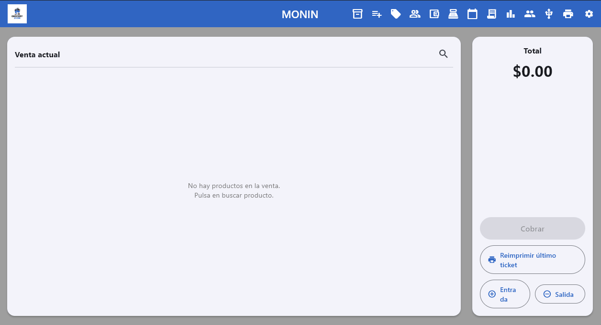
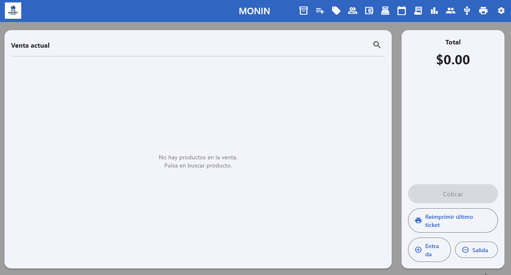
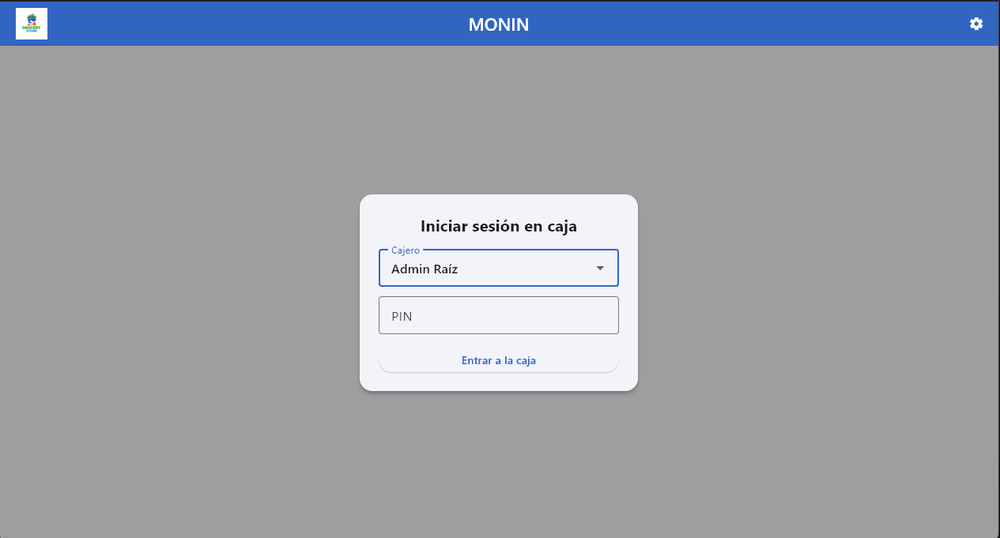

# 🚀 Modular Enterprise Suite: The Core POS
> No es solo un punto de venta. Es la base de un ecosistema diseñado para escalar junto con cualquier negocio.

[🇺🇸 English Version](#-english-version) | [🇲🇽 Versión en Español](#-versión-en-español)

---

## 🇲🇽 Versión en Español

### 💡 La Visión
La mayoría de los POS en el mercado son sistemas cerrados y rígidos. Este proyecto nació de un esfuerzo colaborativo con el objetivo de construir un **núcleo (Core)** ultra sólido que sirva como punto de partida para algo mucho más grande. 

Hoy presentamos el módulo de punto de venta, pero la arquitectura ya está preparada para conectar módulos de **Agendas, CRM, E-commerce, Finanzas y Calendarios**. Es una solución pensada para que el software crezca al mismo ritmo que el negocio; simplemente se añaden piezas según la necesidad.

### 🔐 Gestión de Licencias y Seguridad
Para que un sistema sea profesional, debe ser controlable y seguro. 
* **Control Propietario:** Desarrollamos un sistema conjunto para generar, otorgar y monitorear licencias de uso personalizadas. 
* **Transparencia:** Por razones obvias de seguridad y protección de propiedad intelectual, el generador de licencias se mantiene en un repositorio privado. Lo que ves aquí es la interfaz y la lógica del cliente (el POS), que es el motor que el usuario final opera día a día.

### 🛠️ Lo que hay bajo el capó
* **Interfaz:** Limpia, intuitiva y sin distracciones. Menos clics, más ventas.
* **Base de Datos:** SQLite para una respuesta inmediata y autonomía total sin depender de conexión constante.
* **Escalabilidad:** Código modular y cooperativo listo para recibir nuevas funciones sin romper lo existente.

---

### 📽️ Un vistazo al sistema

#### 🌟 El Todo en Uno (All Functions)
Un recorrido rápido por las capacidades actuales del sistema y su fluidez de navegación.

  

#### 🛒 Experiencia de Compra (Animation)
Desde el escaneo hasta el ticket. Un flujo pensado para que el cajero actúe rápido y sin errores.

  

#### 📦 Control de Inventario (Inventory)
Gestión de stock sin complicaciones. Agregar productos es un proceso natural y fluido.

  

#### 🔑 Seguridad de Acceso (Login)
El primer filtro del sistema. Robusto, sencillo y directo a lo que importa: vender.

  

---

## 🇺🇸 English Version

### 💡 The Vision
Most POS systems are closed boxes. This project was developed as a collaborative effort to build an ultra-solid **Core** that serves as a launchpad for a complete business suite. 

Right now, it's a powerful POS, but the architecture is already "plug-and-play" ready for **Agendas, CRM, E-commerce, Finance, and Calendars**. It’s a solution designed so a business never outgrows its software; you just add modules as needed.

### 🔐 Licensing & Security
Professional software requires professional control.
* **Total Control:** We’ve developed a proprietary system to generate, grant, and track activation licenses.
* **Security Note:** For obvious IP and security reasons, the license engine is kept in a private repository. This public repo showcases the POS UI and client-side logic—the actual engine the end-user interacts with.

### 📽️ System Showcase

#### 🌟 Full Overview (All Functions)
A quick tour of the system's capabilities and its seamless navigation.

  

#### 🛒 Sales Workflow (Animation)
From item selection to receipt generation. A flow designed for speed and zero friction.

  

#### 📦 Inventory Control
Hassle-free stock management. Adding products is as natural as it should be.

  

#### 🔑 Secure Login
The first line of defense. Robust, simple, and straight to business.

  

---

### 🚀 Tech Stack
* **Frontend:** Flutter / Dart (Clean UI)
* **Database:** SQLite (Local & Fast)
* **Architecture:** Modular & Collaborative design
